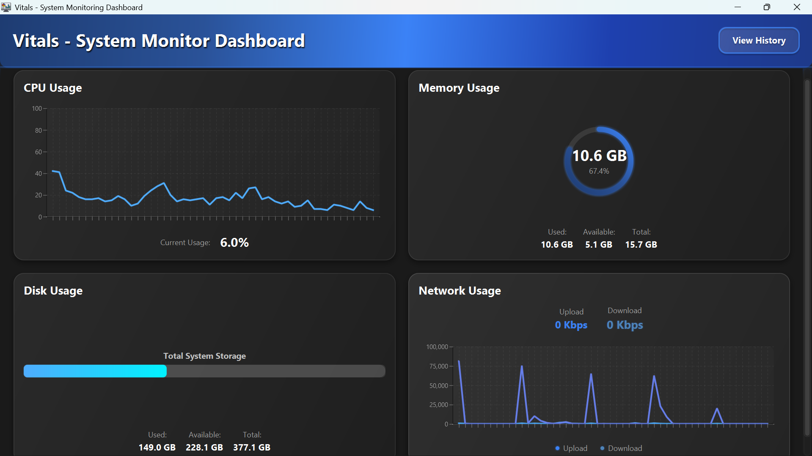
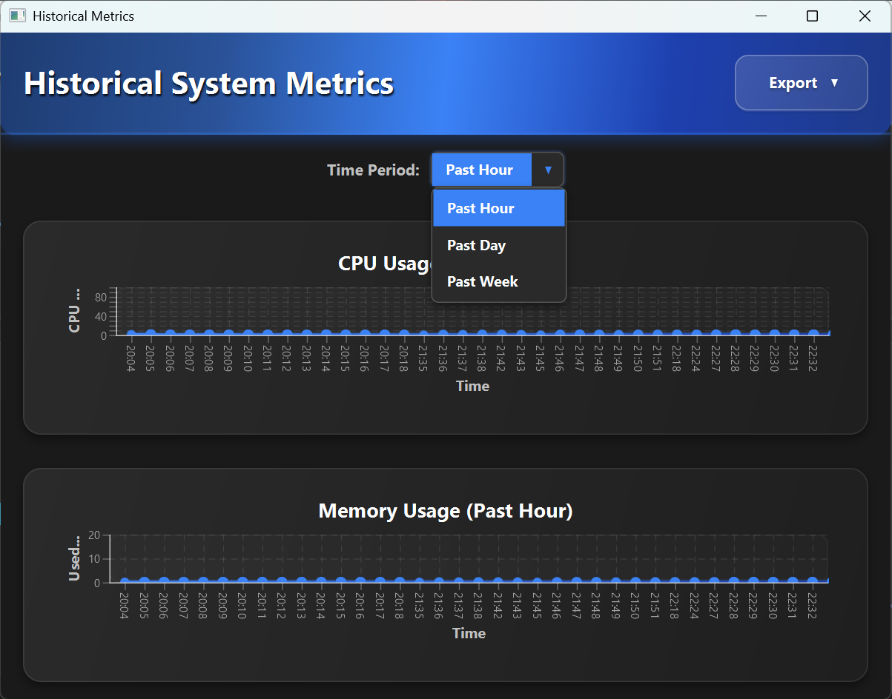
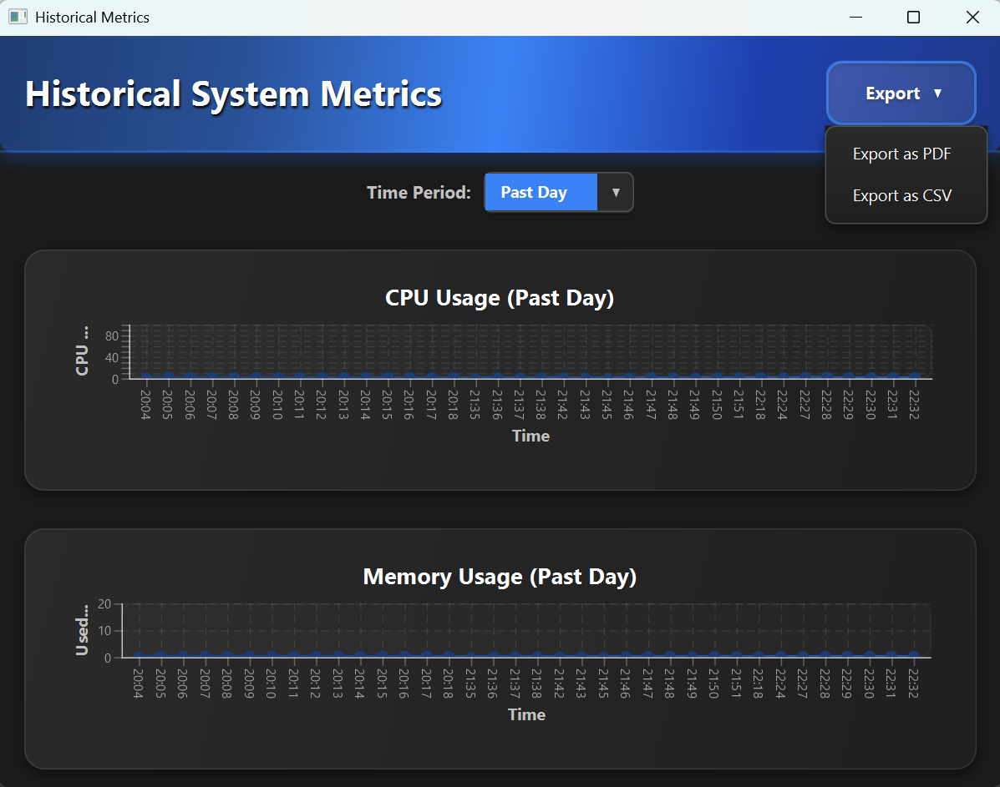

# ⚙️ Vitals – System Monitor Dashboard

A powerful desktop application built with JavaFX that offers **real-time and historical system monitoring**. Get instant insights into your **CPU**, **Memory**, **Disk**, and **Network** activity through a stunning dark-themed dashboard with export options for diagnostics and documentation.

[](https://www.oracle.com/java/)
[](https://openjfx.io/)
[](https://maven.apache.org/)
[](LICENSE/LICENSE.txt)


---

## 🧠 Why Use Vitals?

Traditional system monitoring tools are either overly simplistic or cluttered. **Vitals** is built for developers and power users who want a **clean, professional dashboard** with **exportable system insights**.

---

## 🚀 Key Features

### 📊 Real-Time Monitoring
- **CPU Usage**: Clock speed, temperature, process count
- **Memory Usage**: Used, available, and total RAM
- **Disk Usage**: Capacity and current utilization
- **Network Activity**: Upload and download speed

### 🕒 Historical Logging
- **SQLite-backed logging**: Efficient time-series storage
- **Time range filter**: View metrics from past hour, day, or week
- **Aggregated charts**: Smart in-memory aggregation for readability

### 📝 Export System Snapshots
- **PDF Export**: Beautifully formatted system status reports
- **CSV Export**: For logs, diagnostics, or analysis

---

## 📸 Screenshots

### Real-Time Dashboard  


### Historical Metrics View  


### Export Options  


---

## 🛠️ Tech Stack

- **Java 24** – Latest version for modern capabilities
- **JavaFX 21** – UI toolkit for building sleek desktop UIs
- **OSHI** – Open Source Hardware Info for system data
- **SQLite** – Lightweight embedded database
- **Apache PDFBox** – (Optional) For generating PDF reports
- **Maven** – Build and dependency management

---

## 📋 System Requirements

### Prerequisites
- **JDK 24** or higher  
- **JavaFX SDK 21**
- **Maven 3.6+**
- Git (for repository cloning)

### Verify Your Setup
```bash
# Check Java version (should be 21+)
java -version

# Check Maven version (should be 3.6+)
mvn -version

# Verify Git installation
git --version
```

---

## ⚡ Quick Start

### 1. Clone the Repository
```bash
git clone https://github.com/AnkeshGG/VitalsSystemMonitor.git
cd VitalsSystemMonitor
```

### 2. Build the Project
```bash
mvn clean install
```

### 3. Run the Application
```bash
mvn javafx:run
```

Or run the packaged JAR:
```bash
java -jar target/vitals-1.0.0-jar-with-dependencies.jar
```

---

## 🏗️ Project Structure

```
Vitals/
├── src/main/java/com/example/vitals/
│   ├── Main.java
│   ├── Launcher.java
│   ├── controllers/
│   │   ├── DashboardController.java
│   │   ├── HistoricalController.java
│   │   └── SystemInfoController.java
│   ├── dao/
│   │   └── HistoricalDataDAO.java
│   ├── models/
│   │   ├── CPUUsage.java
│   │   ├── MemoryUsage.java
│   │   ├── DiskUsage.java
│   │   └── NetworkActivity.java
│   └── utils/
│       ├── AggregationHelper.java
│       ├── ReportExporter.java
│       └── SystemMonitor.java
├── src/main/resources/
│   ├── icons/icon.png
│   ├── fxml/dashboard.fxml
│   └── css/
│       ├── styles.css
│       └── system_info_styles.css
├── pom.xml
├── LICENSE/
│   └── LICENSE.txt
└── README.md 
```

---

## 📦 Export System Reports

Vitals provides **PDF/CSV export** of your system's current state:

- **PDF Export**: Neatly formatted summary using `ReportExporter.java`
- **CSV Export**: Raw snapshot for data analysis

Initiate export via the **Export Dropdown** in the Historical Metrics window.

---

## 🧪 Testing

> Unit and integration tests are planned in upcoming versions.

---

## 💡 Future Enhancements

- [ ] Add temperature monitoring graph
- [ ] Add CPU core-wise breakdown
- [ ] Add theme toggle (light/dark)
- [ ] Add automatic periodic export
- [ ] Add system alert notification support

---

## 🤝 Contributing

You're welcome to contribute to this open-source project!

### Steps:
1. Fork the repo
2. Create a branch: `git checkout -b feature/newFeature`
3. Commit your changes
4. Push: `git push origin feature/newFeature`
5. Submit a pull request

### Guidelines
- Follow Java code conventions
- Keep UI/UX clean and consistent
- Test thoroughly before submitting PRs

---

## 📦 Download

Visit the [Releases Page](https://github.com/AnkeshGG/VitalsSystemMonitor/releases) to download:

- 🖥️ **Windows Installer (.msi)**: `VitalsInstaller-v1.0.0.msi`

The MSI installer sets up the application as a native Windows app with proper shortcuts and file associations.

---

## 📄 License

This project is licensed under the **MIT License** – see the [LICENSE.txt](LICENSE/LICENSE.txt) for details.

---

## 👨‍💻 About the Author

**Ankesh Kumar** – *Java Developer & UI Enthusiast*

> I'm passionate about building intuitive desktop tools that simplify technical tasks. Vitals was created out of a need for a visually rich and export-ready system monitoring solution.

### Connect With Me
- 🌐 **GitHub**: [@AnkeshGG](https://github.com/AnkeshGG)
- 💼 **LinkedIn**: [Ankesh Kumar](https://www.linkedin.com/in/ankesh-kumar-38363a287/)
- 📧 **Email**: [ankeshkumar.dev@gmail.com](mailto:ankeshkumar.dev@gmail.com)
- 🔗 **Medium**: [ankeshGG](https://medium.com/@ankeshGG)

---

## 🙏 Acknowledgements

- **OSHI** – For excellent system-level data APIs
- **JavaFX Community** – For GUI framework and inspiration
- **PDFBox Team** – For seamless PDF generation
- **Open Source Devs** – Who make dev tools better every day

---

## 📊 Project Status

🟢 Actively maintained

- **Version**: 1.0.0  
- **Last Updated**: June 2025  
- **Stars**: ⭐ Give this project a star if you found it helpful!
- **Issues Resolved**: Tracking via GitHub Issues
- **Latest Release**: v1.0.0

---

### 🔍 Ready to Monitor Your System Like a Pro?

Don't let hidden bottlenecks slow down your workflow. Vitals gives you a complete view of your system's health—real-time stats, historical insights, and exportable reports—so you can optimize performance and stay in control.

**[⬇️ Download Now](https://github.com/AnkeshGG/VitalsSystemMonitor/releases)** | **[📖 Quick Start Guide](#-quick-start)** | **[🤝 Contribute](#-contributing)**

---
© 2025 Ankesh Kumar.

*Your success story could inspire the next developer to build something amazing.*

